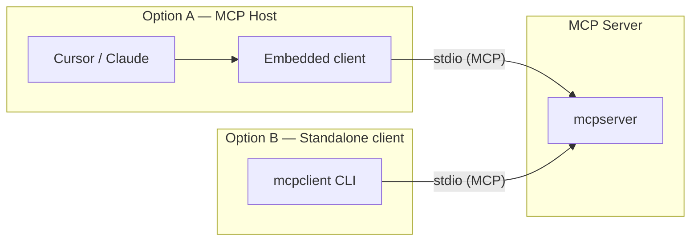

# MCP Clients

Standalone MCP clients that speak JSON-RPC over stdio (or HTTP) to connect to servers — most hosts embed their own client; this folder catalogs **test CLIs** in the repo.

## 🚀 Quick Start

```bash
cd GitHubSummary/mcpserver && just build
cd ../mcpclient && just build && just run
```

Direct test:

```bash
just test owner/repo username
```

**Not registered in any IDE** — for daily use, configure **mcpserver** in a host: [MCP-Hosts](../MCP-Hosts/README.md#-quick-start).

### Usage

```bash
just run                              # interactive — lists tools, prompts for input
just test rslakra/Samples rslakra     # direct call with defaults
python client.py -r owner/repo -u user
```

## ✨ Features

- Catalog of **standalone MCP clients** in this repository
- **Terminal-based testing** without Cursor, Claude, or VS Code
- Clear distinction: **embedded clients** (inside hosts) vs **standalone CLIs**
- Links to IDE host configuration for daily use

## 📋 Prerequisites & Dependencies

- **Python 3.10+**
- **[just](https://github.com/casey/just)** command runner
- **MCP server built** at `GitHubSummary/mcpserver`

| Source | Purpose |
| ------ | ------- |
| `GitHubSummary/mcpclient/requirements.txt` | MCP SDK, Rich — installed by `just build` |
| `GitHubSummary/mcpserver/` | Server this client connects to — build first |

## ⚙️ Build & Configuration

### Build

```bash
cd GitHubSummary/mcpserver && just build
cd ../mcpclient && just build
```

### Environment variables

Optional `.env` in `mcpclient/`:

| Variable | Required | Description |
| -------- | -------- | ----------- |
| `GITHUB_TOKEN` | No | Classic PAT — or rely on server `just login` |

## 📁 Project Layout

```
MCP-Apps/
├── MCP Clients/
│   └── README.md           ← you are here
└── GitHubSummary/
    └── mcpclient/          ← standalone test CLI
```

| Client | Path | README |
| ------ | ---- | ------ |
| GitHub Summary CLI | `GitHubSummary/mcpclient/` | [README](../GitHubSummary/mcpclient/README.md) |

## 🏗️ Architecture



| Approach | When to use |
| -------- | ----------- |
| **Standalone mcpclient** | Debug tools, CI, learn MCP without an IDE |
| **IDE host** | Daily use — configure **server** only in [MCP-Hosts](../MCP-Hosts/README.md) |

## 🧪 Testing

```bash
cd GitHubSummary/mcpclient
just test
just test owner/repo username
just run    # interactive exploration
```

## 🛠️ Troubleshooting

| Issue | Fix |
| ----- | --- |
| Server not found | `cd GitHubSummary/mcpserver && just build` |
| Import errors | `cd GitHubSummary/mcpclient && just build` |
| Rate limit errors | Set `GITHUB_TOKEN` in `.env` or `just login` on server |
| Expected IDE config | Terminal only — configure server in [MCP-Hosts](../MCP-Hosts/README.md) |

## 📚 References

### In this repository

| README | Description |
| ------ | ----------- |
| [MCP-Apps](../README.md) | Root index |
| [MCP-Hosts](../MCP-Hosts/README.md) | Configure server in Cursor, Claude, VS Code, … |
| [MCP Servers](../MCP%20Servers/README.md) | Servers this client connects to |
| [GitHubSummary](../GitHubSummary/README.md) | Parent project |
| [mcpclient](../GitHubSummary/mcpclient/README.md) | CLI implementation |
| [mcpserver](../GitHubSummary/mcpserver/README.md) | Server to build first |

### External Documentation

| Link | Description |
| ---- | ----------- |
| [modelcontextprotocol.io](https://modelcontextprotocol.io) | Official MCP specification |
| [MCP architecture](https://modelcontextprotocol.io/docs/learn/architecture) | Host, client, and server roles |

## 📄 License

MIT — see [mcpserver](../GitHubSummary/mcpserver/README.md#-license).

## 👤 Author

- **Rohtash Lakra** — [@rslakra](https://github.com/rslakra)
