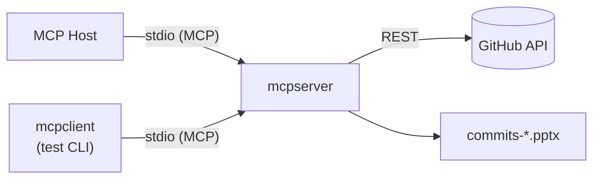

# MCP Servers

MCP servers expose tools and resources — hosts (or standalone clients) launch a server process and communicate over stdio or HTTP.

## 🚀 Quick Start

```bash
cd GitHubSummary/mcpserver
just build && just login
just generate owner/repo username light
```

Run stdio server:

```bash
just run
```

Register in Cursor:

```bash
just deploy    # copies template to ~/.cursor/mcp.json
```

**Full IDE guide:** [MCP-Hosts](../MCP-Hosts/README.md#-quick-start)

### Configure in your IDE

Minimal **Cursor** entry:

```json
{
  "mcpServers": {
    "github-summary": {
      "command": "/ABSOLUTE/PATH/GitHubSummary/mcpserver/venv/bin/python",
      "args": ["/ABSOLUTE/PATH/GitHubSummary/mcpserver/main.py", "server"]
    }
  }
}
```

| Host | Config file |
| ---- | ----------- |
| Cursor | `~/.cursor/mcp.json` |
| Windsurf | `~/.codeium/windsurf/mcp_config.json` |
| Claude Desktop | OS-specific — see [MCP-Hosts](../MCP-Hosts/README.md) |
| VS Code / Copilot | `.vscode/mcp.json` — `"servers"` + `"type": "stdio"` |

## ✨ Features

- Catalog of **MCP server implementations** in this repository
- **stdio transport** for IDE hosts and standalone clients
- **`just deploy`** helper for Cursor MCP config
- Links to full **IDE configuration** guides

## 📋 Prerequisites & Dependencies

- **Python 3.10+**
- **[just](https://github.com/casey/just)** command runner
- **GitHub account** — OAuth device flow or classic PAT with `repo` scope

| Source | Purpose |
| ------ | ------- |
| `GitHubSummary/mcpserver/requirements.txt` | MCP SDK, PyGithub, python-pptx — `just build` |

## ⚙️ Build & Configuration

### Build

```bash
cd GitHubSummary/mcpserver
just build && just login
```

### Environment variables

| Variable | Required | Description |
| -------- | -------- | ----------- |
| `GITHUB_TOKEN` | No* | Classic PAT with `repo` scope |
| `GITHUB_CLIENT_ID` | No | OAuth app for device flow |

\*Optional if using `just login` (token stored in `~/.config/github-summary/`).

See [mcpserver README](../GitHubSummary/mcpserver/README.md#️-build--configuration) for authentication details.

### Deploy

```bash
just deploy    # writes Cursor MCP config template
```

## 📁 Project Layout

```
MCP-Apps/
├── MCP Servers/
│   └── README.md           ← you are here
└── GitHubSummary/
    └── mcpserver/          ← GitHub Summary MCP server
```

| Server | Path | README |
| ------ | ---- | ------ |
| GitHub Summary | `GitHubSummary/mcpserver/` | [README](../GitHubSummary/mcpserver/README.md) |

Tool: **`generate_pr_presentation`** — PR summaries → PowerPoint.

## 🏗️ Architecture



## 🧪 Testing

```bash
cd GitHubSummary/mcpserver && just test
just generate owner/repo user light
cd ../mcpclient && just test owner/repo username
```

## 🛠️ Troubleshooting

| Issue | See |
| ----- | --- |
| Auth / rate limits / 404 | [mcpserver — Troubleshooting](../GitHubSummary/mcpserver/README.md#️-troubleshooting) |
| Server not in IDE | [MCP-Hosts — Troubleshooting](../MCP-Hosts/README.md#️-troubleshooting) |
| Wrong component in IDE | Register **mcpserver**, not **mcpclient** |

## 📚 References

### In this repository

| README | Description |
| ------ | ----------- |
| [MCP-Apps](../README.md) | Root index |
| [MCP-Hosts](../MCP-Hosts/README.md) | Configure server in IDEs |
| [MCP Clients](../MCP%20Clients/README.md) | Test without a host |
| [GitHubSummary](../GitHubSummary/README.md) | Parent project |
| [mcpserver](../GitHubSummary/mcpserver/README.md) | Server implementation |
| [mcpclient](../GitHubSummary/mcpclient/README.md) | CLI test client |

### External Documentation

| Link | Description |
| ---- | ----------- |
| [modelcontextprotocol.io](https://modelcontextprotocol.io) | Official MCP specification |
| [Build an MCP server](https://modelcontextprotocol.io/docs/2026-07-28/develop/build-server) | Developing MCP servers |
| [VS Code MCP servers](https://code.visualstudio.com/docs/agent-customization/mcp-servers) | VS Code / Copilot MCP setup |

## 📄 License

MIT — see [mcpserver](../GitHubSummary/mcpserver/README.md#-license).

## 👤 Author

- **Rohtash Lakra** — [@rslakra](https://github.com/rslakra)
