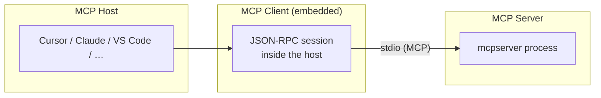

# MCP Hosts

User-facing AI applications that embed MCP clients and connect to MCP servers — you **configure the host** to launch a server, not run the host from this repo.

## 🚀 Quick Start

```bash
cd GitHubSummary/mcpserver
just build && just login

# Get absolute paths for IDE config
echo "$(pwd)/venv/bin/python"
echo "$(pwd)/main.py"
```

Add to **Cursor** (`~/.cursor/mcp.json`):

```json
{
  "mcpServers": {
    "github-summary": {
      "command": "/ABSOLUTE/PATH/GitHubSummary/mcpserver/venv/bin/python",
      "args": ["/ABSOLUTE/PATH/GitHubSummary/mcpserver/main.py", "server"]
    }
  }
}
```

Restart Cursor → **Settings → MCP** → verify `generate_pr_presentation` is listed.

### Configure in your IDE

Only **mcpserver** is registered in IDE settings — not **mcpclient**.

**Cursor / Claude Desktop / Claude Code / Windsurf** — top-level `mcpServers`:

```json
"github-summary": {
  "command": "/ABSOLUTE/PATH/GitHubSummary/mcpserver/venv/bin/python",
  "args": ["/ABSOLUTE/PATH/GitHubSummary/mcpserver/main.py", "server"]
}
```

**VS Code / GitHub Copilot** — top-level `servers` with `"type": "stdio"`:

```json
{
  "servers": {
    "github-summary": {
      "type": "stdio",
      "command": "/ABSOLUTE/PATH/GitHubSummary/mcpserver/venv/bin/python",
      "args": ["/ABSOLUTE/PATH/GitHubSummary/mcpserver/main.py", "server"]
    }
  }
}
```

#### Cursor

| Item | Value |
| ---- | ----- |
| Config file | `~/.cursor/mcp.json` |
| Deploy helper | `cd GitHubSummary/mcpserver && just deploy` |

#### Windsurf

Config: `~/.codeium/windsurf/mcp_config.json` — same `mcpServers` block as Cursor.

#### Claude Desktop

| OS | Config file |
| -- | ----------- |
| macOS | `~/Library/Application Support/Claude/claude_desktop_config.json` |
| Windows | `%APPDATA%\Claude\claude_desktop_config.json` |
| Linux | `~/.config/Claude/claude_desktop_config.json` |

#### Claude Code (CLI)

```bash
claude mcp add github-summary -- \
  /ABSOLUTE/PATH/GitHubSummary/mcpserver/venv/bin/python \
  /ABSOLUTE/PATH/GitHubSummary/mcpserver/main.py server
```

Or merge into `~/.claude.json` under `mcpServers`. List: `claude mcp list`.

#### VS Code / GitHub Copilot

| Scope | Config file |
| ----- | ----------- |
| Workspace | `.vscode/mcp.json` |
| User | Command Palette → **MCP: Open User Configuration** |

Optional secret input (avoid committing tokens):

```json
{
  "inputs": [{
    "type": "promptString",
    "id": "github-token",
    "description": "GitHub classic token (repo scope)",
    "password": true
  }],
  "servers": {
    "github-summary": {
      "type": "stdio",
      "command": "/ABSOLUTE/PATH/GitHubSummary/mcpserver/venv/bin/python",
      "args": ["/ABSOLUTE/PATH/GitHubSummary/mcpserver/main.py", "server"],
      "env": { "GITHUB_TOKEN": "${input:github-token}" }
    }
  }
}
```

Command Palette: **MCP: List Servers** → start / restart `github-summary`.

#### Other IDEs and tools

| Tool | Config approach |
| ---- | ---------------- |
| **Zed** | `~/.zed/settings.json` → `context_servers` |
| **Continue.dev** | `~/.continue/config.json` → `experimental.modelContextProtocolServers` |
| **Cline** | MCP Servers panel — stdio server |
| **JetBrains AI** | Settings → MCP — stdio server |

#### Standalone client (not a host)

```bash
cd GitHubSummary/mcpclient && just build && just run
```

## ✨ Features

- Guides for **Cursor**, **Windsurf**, **Claude Desktop**, **Claude Code**, **VS Code / GitHub Copilot**, and other IDEs
- **JSON config snippets** with absolute paths for the GitHub Summary server
- Clear rules for **what to configure** — server in IDE; client CLI in terminal only
- **Verification steps** to confirm MCP tools are available

## 📋 Prerequisites & Dependencies

- **GitHub Summary server built** — [mcpserver Build & Configuration](../GitHubSummary/mcpserver/README.md#️-build--configuration)
- **Absolute paths** to `venv/bin/python` and `main.py`
- **MCP-capable host** — Cursor, Claude Desktop, VS Code with Copilot, Windsurf, etc.

| Source | Purpose |
| ------ | ------- |
| `GitHubSummary/mcpserver/` | Server process launched by host config — `just build` there first |
| This folder | Documentation only — no executable code |

## ⚙️ Build & Configuration

### Build

Build the server before editing host config:

```bash
cd GitHubSummary/mcpserver
just build && just login
```

### Environment variables

Optional in host config if not using `just login`:

```json
"env": { "GITHUB_TOKEN": "ghp_your_classic_token" }
```

| Variable | Required | Description |
| -------- | -------- | ----------- |
| `GITHUB_TOKEN` | No* | Classic PAT with `repo` scope (*stored token from `just login` is enough) |

### Security

- Never commit tokens in `.vscode/mcp.json` — use VS Code `inputs` for secrets
- Use absolute paths to venv Python — relative paths break in IDE spawns

## 📁 Project Layout

```
MCP-Apps/
├── MCP-Hosts/
│   └── README.md           ← you are here
└── GitHubSummary/
    └── mcpserver/          ← server to register in your host
```

## 🏗️ Architecture



| MCP role | Configured in IDE? | This repo |
| -------- | ------------------ | --------- |
| **Host** | Yes — the IDE app | Cursor, Claude, VS Code, Windsurf, … |
| **Server** | Yes — launches `mcpserver` | [mcpserver](../GitHubSummary/mcpserver/README.md) |
| **Client (embedded)** | Automatic | No file to edit |
| **Client (standalone)** | **No** — terminal | [mcpclient](../GitHubSummary/mcpclient/README.md) |

## 🧪 Testing

1. `cd GitHubSummary/mcpserver && just auth-status`
2. Host shows `github-summary` connected (MCP panel / settings)
3. Prompt: *Generate a PR presentation for user `YOUR_USER` in `owner/repo` with light theme*
4. Without IDE: `cd GitHubSummary/mcpclient && just test owner/repo username`

## 🛠️ Troubleshooting

**Server not appearing in IDE**

- Use **absolute paths** to `venv/bin/python` and `main.py`
- Run `just build` and `just auth-status` before connecting
- Restart IDE or **MCP: List Servers** → restart (VS Code)

**Wrong config key format**

| Host | Top-level key | Type field |
| ---- | ------------- | ---------- |
| Cursor, Claude, Windsurf | `mcpServers` | — |
| VS Code / Copilot | `servers` | `"type": "stdio"` |

**Tools not listed**

- Test server directly: `cd GitHubSummary/mcpserver && just run`
- Check host MCP logs for spawn failures

## 📚 References

### In this repository

| README | Description |
| ------ | ----------- |
| [MCP-Apps](../README.md) | Root index |
| [MCP Clients](../MCP%20Clients/README.md) | Standalone test clients |
| [MCP Servers](../MCP%20Servers/README.md) | Server implementations |
| [GitHubSummary](../GitHubSummary/README.md) | Sample project |
| [mcpserver](../GitHubSummary/mcpserver/README.md) | Server setup |
| [mcpclient](../GitHubSummary/mcpclient/README.md) | CLI test client |

### External Documentation

| Link | Description |
| ---- | ----------- |
| [modelcontextprotocol.io](https://modelcontextprotocol.io) | Official MCP specification |
| [MCP architecture](https://modelcontextprotocol.io/docs/learn/architecture) | Host, client, and server roles |
| [VS Code MCP servers](https://code.visualstudio.com/docs/agent-customization/mcp-servers) | VS Code / Copilot MCP setup |
| [GitHub Copilot MCP](https://docs.github.com/en/copilot/how-tos/provide-context/use-mcp-in-your-ide/extend-copilot-chat-with-mcp) | Copilot Chat + MCP |

## 📄 License

MIT — see [mcpserver](../GitHubSummary/mcpserver/README.md#-license).

## 👤 Author

- **Rohtash Lakra** — [@rslakra](https://github.com/rslakra)
