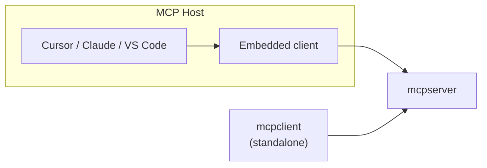

# Model Context Protocol (MCP) Apps

MCP **hosts**, **clients**, and **servers** organized by role — each project has its own README with setup and run instructions.

## 🚀 Quick Start

```bash
cd GitHubSummary/mcpserver
just build && just login
just generate owner/repo username light
```

**Test without an IDE:**

```bash
cd GitHubSummary/mcpclient && just build && just run
```

**Register in Cursor:**

```bash
cd GitHubSummary/mcpserver && just deploy
# Edit ~/.cursor/mcp.json — absolute paths; restart Cursor
```

### Configure in your IDE

| Role | Where to configure | Guide |
| ---- | ------------------ | ----- |
| **MCP Host** | IDE config file | [MCP-Hosts](./MCP-Hosts/README.md#-quick-start) |
| **MCP Server** (`mcpserver`) | Entry inside host config | [mcpserver](./GitHubSummary/mcpserver/README.md#configure-in-your-ide) |
| **MCP Client** (embedded) | Automatic inside host | No setup |
| **Standalone mcpclient** | Terminal only | [MCP Clients](./MCP%20Clients/README.md#-quick-start) |

## ✨ Features

- **Role-based layout** — [MCP-Hosts](./MCP-Hosts/README.md), [MCP Clients](./MCP%20Clients/README.md), [MCP Servers](./MCP%20Servers/README.md)
- **End-to-end sample** — [GitHub Summary](./GitHubSummary/README.md): PR summaries → PowerPoint via MCP
- **IDE configuration** — Cursor, Claude Desktop, Claude Code, VS Code / GitHub Copilot, Windsurf
- **Standalone test client** — exercise the server without an IDE

## 📋 Prerequisites & Dependencies

- **Python 3.10+**
- **[just](https://github.com/casey/just)** command runner
- **MCP host** (optional) — Cursor, Claude Desktop, VS Code, etc.
- **GitHub account** — for GitHub Summary server

| Source | Purpose |
| ------ | ------- |
| `GitHubSummary/mcpserver/requirements.txt` | MCP server packages — `just build` in mcpserver |
| `GitHubSummary/mcpclient/requirements.txt` | CLI client packages — `just build` in mcpclient |

## ⚙️ Build & Configuration

### Build

```bash
cd GitHubSummary/mcpserver
just build && just login
```

### Environment variables

See [mcpserver — Build & Configuration](./GitHubSummary/mcpserver/README.md#️-build--configuration). Copy `env.example` to `.env` — never commit secrets.

| Variable | Required | Description |
| -------- | -------- | ----------- |
| `GITHUB_TOKEN` | No* | Classic PAT with `repo` scope (*optional if using `just login`) |
| `GITHUB_CLIENT_ID` | No | OAuth app client ID for device flow |

### Security

- Do **not** commit GitHub tokens, `.env` files, or PATs to git
- Prefer **classic** tokens with `repo` scope for private/org repos

## 📁 Project Layout

```
MCP-Apps/
├── README.md                 ← you are here
├── MCP-Hosts/
├── MCP Clients/
├── MCP Servers/
└── GitHubSummary/
    ├── mcpserver/            # MCP server
    └── mcpclient/            # MCP test client
```

| Project | Role | README |
| ------- | ---- | ------ |
| GitHub Summary — server | MCP Server | [mcpserver](./GitHubSummary/mcpserver/README.md) |
| GitHub Summary — client | MCP Client | [mcpclient](./GitHubSummary/mcpclient/README.md) |

## 🏗️ Architecture

| Role | Description | In this repo |
| ---- | ----------- | ------------ |
| **Host** | User-facing AI app; embeds MCP clients | [MCP-Hosts](./MCP-Hosts/README.md) |
| **Client** | JSON-RPC bridge between host and server | [MCP Clients](./MCP%20Clients/README.md) → [mcpclient](./GitHubSummary/mcpclient/README.md) |
| **Server** | Exposes tools, resources, and data | [MCP Servers](./MCP%20Servers/README.md) → [mcpserver](./GitHubSummary/mcpserver/README.md) |



**Full diagram:** [GitHubSummary — Architecture](./GitHubSummary/README.md#️-architecture)

Most developers **build servers** and register them in a **host**. Use **mcpclient** to test without an IDE.

## 🧪 Testing

```bash
cd GitHubSummary/mcpserver && just test
cd GitHubSummary/mcpclient && just test owner/repo username
```

## 🛠️ Troubleshooting

| Issue | See |
| ----- | --- |
| Server auth / rate limits | [mcpserver — Troubleshooting](./GitHubSummary/mcpserver/README.md#️-troubleshooting) |
| IDE not showing server | [MCP-Hosts — Troubleshooting](./MCP-Hosts/README.md#️-troubleshooting) |
| Client cannot connect | [mcpclient — Troubleshooting](./GitHubSummary/mcpclient/README.md#️-troubleshooting) |
| Committed secrets | Rotate token; remove from git history |

## 📚 References

### In this repository

| README | Scope |
| ------ | ----- |
| [MCP-Hosts](./MCP-Hosts/README.md) | Configure MCP in Cursor, Claude, VS Code, … |
| [MCP Clients](./MCP%20Clients/README.md) | Standalone MCP clients |
| [MCP Servers](./MCP%20Servers/README.md) | MCP server implementations |
| [GitHubSummary](./GitHubSummary/README.md) | End-to-end demo |
| [mcpserver](./GitHubSummary/mcpserver/README.md) | Server setup and IDE config |
| [mcpclient](./GitHubSummary/mcpclient/README.md) | CLI test client |

### External Documentation

| Link | Description |
| ---- | ----------- |
| [modelcontextprotocol.io](https://modelcontextprotocol.io) | Official MCP specification |
| [Build an MCP server](https://modelcontextprotocol.io/docs/2026-07-28/develop/build-server) | Developing MCP servers |
| [MCP architecture](https://modelcontextprotocol.io/docs/learn/architecture) | Host, client, and server roles |
| [VS Code MCP servers](https://code.visualstudio.com/docs/agent-customization/mcp-servers) | VS Code / Copilot MCP setup |
| [GitHub Copilot MCP](https://docs.github.com/en/copilot/how-tos/provide-context/use-mcp-in-your-ide/extend-copilot-chat-with-mcp) | Copilot Chat + MCP |

## 📄 License

MIT — see [GitHubSummary/mcpserver](./GitHubSummary/mcpserver/README.md#-license).

## 👤 Author

- **Rohtash Lakra** — [@rslakra](https://github.com/rslakra)
